# PC3_CC3S2_24-1 - PREGUNTA 2
## SPRINT 1: Estructura básica del juego y movimiento
### Clases a implementar:
* Juego: Clase principal para iniciar y controlar el flujo del juego.  
* Habitación: Representa una habitación en el juego.  
* Jugador: Representa al jugador y rastrea su inventario y ubicación actual.  
### Tareas:
1. Inicialización del juego: Inicializa el juego con un conjunto de habitaciones.o Define la habitación inicial para el jugador.  
2. Movimiento del jugador: Permite al jugador moverse entre habitaciones usando comandos.  
3. Interacción básica: Implementa comandos básicos para el movimiento (por ejemplo, "mover norte").  
### Enfoque TDD:
Escribe pruebas para la creación de habitaciones, movimiento del jugador e inicialización del juego.  
### Salida:
Navegación funcional entre habitaciones.  
Mostrar la descripción de la habitación actual al entrar.  

Creo los tests primero para seguir el enfoque TDD  
``` java
import org.example.Juego;
import org.example.Jugador;
import org.junit.Test;

import static org.testng.Assert.assertEquals;
import static org.testng.Assert.assertThrows;

public class JuegoTest {
    // Tests para la creacion de habitaciones
    @Test
    public void CreacionDeHabitacionesConExitoTest(){
        // Arrange
        int n_habitaciones = 5;
        Juego juego = new Juego();
        // Act
        int n_habitaciones_creadas = juego.crearHabitaciones(n_habitaciones);
        // Assert
        assertEquals(5, n_habitaciones_creadas, "Deberia ser 5");
    }
    @Test
    public void CreacionDeHabitacionesSinExitoTest(){
        // Arrange
        int n_habitaciones = -2;
        Juego juego = new Juego();
        // Act y Assert
        assertThrows(IllegalArgumentException.class, ()->{
            juego.crearHabitaciones(n_habitaciones);
        });
    }

    // Tests para el movimiento del jugador
    @Test
    public void MovimientoDeJugadorHaciaElNorteTest(){
        // Arrange
        Jugador jugador = new Jugador();
        String direccion = "norte";
        // Act
        String resultado = jugador.moverHacia(direccion);
        // Assert
        assertEquals("Te mueves al norte", resultado, "Deberia moverse al norte");
    }
    @Test
    public void MovimientoDeJugadorHaciaElSurTest(){
        // Arrange
        Jugador jugador = new Jugador();
        String direccion = "sur";
        // Act
        String resultado = jugador.moverHacia(direccion);
        // Assert
        assertEquals("Te mueves al sur", resultado, "Deberia moverse al sur");
    }
    @Test
    public void MovimientoDeJugadorHaciaElOesteTest(){
        // Arrange
        Jugador jugador = new Jugador();
        String direccion = "oeste";
        // Act
        String resultado = jugador.moverHacia(direccion);
        // Assert
        assertEquals("Te mueves al oeste", resultado, "Deberia moverse al oeste");
    }
    @Test
    public void MovimientoDeJugadorHaciaElEsteTest(){
        // Arrange
        Jugador jugador = new Jugador();
        String direccion = "este";
        // Act
        String resultado = jugador.moverHacia(direccion);
        // Assert
        assertEquals("Te mueves al este", resultado, "Deberia moverse al este");
    }

    // Test para la inicializacion del juego
    @Test
    public void InicializacionDelJuegoTest(){
        // Arrange
        Juego juego = new Juego();
        int n_habitaciones = 5;
        juego.crearHabitaciones(n_habitaciones);
        int habitacion_inicial = 2;
        juego.setHabitacionActual(habitacion_inicial);
        // Act
        String resultado = juego.getHabitacionActual().descripcionHabitacion();
        // Assert
        assertEquals("Estas en la habitacion 2", resultado, "Deberia mostrar que esta en la habitacion 2");
    }
}
``` 
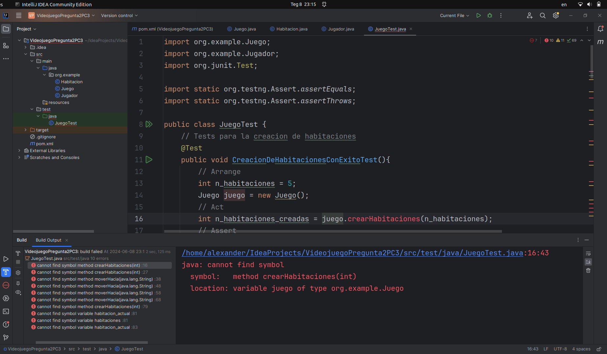  
Como se observa en la imagen, los tests fallan debido a que aun las clases Juego, Habitacion y Juegor no han sido implementadas.  
Ahora, teniendo como base las pruebas escritas, escribo codigo suficimiente para hacer pasar los tests.  

``` java
package org.example;

import java.util.Scanner;

public class Juego {
    Habitacion habitacion_actual;
    Habitacion[] habitaciones;
    public int crearHabitaciones(int nHabitaciones) {
        if(nHabitaciones <= 0){
            throw new IllegalArgumentException("Cantidad invalida de habitaciones");
        }
        habitaciones = new Habitacion[nHabitaciones];
        for(int i = 0; i < nHabitaciones; i++){
            Habitacion h = new Habitacion();
            h.setNHabitacion(i + 1);
            habitaciones[i] = h;
        }
        return habitaciones.length;
    }
    public void setHabitacionActual(int habitacionInicial) {
        habitacion_actual = habitaciones[habitacionInicial-1];
    }
    public Habitacion getHabitacionActual(){
        return habitacion_actual;
    }

    public static void main(String[] args) {
        Scanner scanner = new Scanner(System.in);
        int num_habitaciones = 5;
        Juego juego = new Juego();
        Jugador jugador = new Jugador();
        juego.crearHabitaciones(num_habitaciones);
        int habitacion_actual = 2;
        juego.setHabitacionActual(habitacion_actual);
        System.out.println("Inicio del juego, existen " + num_habitaciones + " habitaciones");
        System.out.println(juego.getHabitacionActual().descripcionHabitacion());
        System.out.println("Puedes moverte hacia los puntos cardinales");
        String movimiento = scanner.nextLine().toLowerCase();
        System.out.println(jugador.moverHacia(movimiento));
    }
}
```
``` java
package org.example;

public class Habitacion {
    int n_habitacion;
    public void setNHabitacion(int numero_habitacion) {
        n_habitacion = numero_habitacion;
    }
    public String descripcionHabitacion(){
        return "Estas en la habitacion " + n_habitacion;
    }
}
```
``` java
package org.example;

public class Jugador {
    public String moverHacia(String direccion) {
        return "Te mueves al " + direccion;
    }
}
```
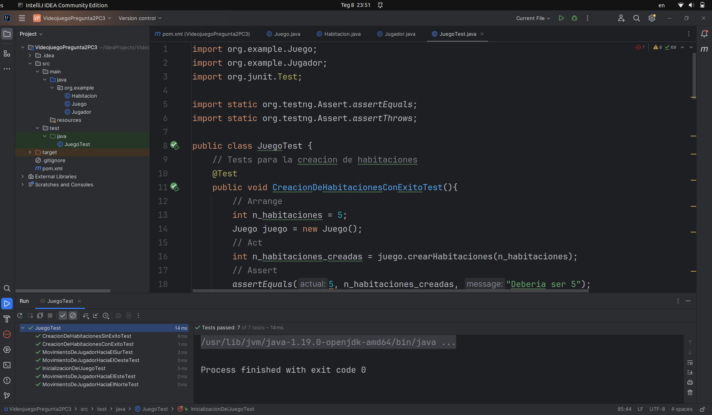  
Como se observa en la imagen, los 7 tests pasaron exitosamente (estan color verde).  

Ejecucion de la clase principal, Juego  
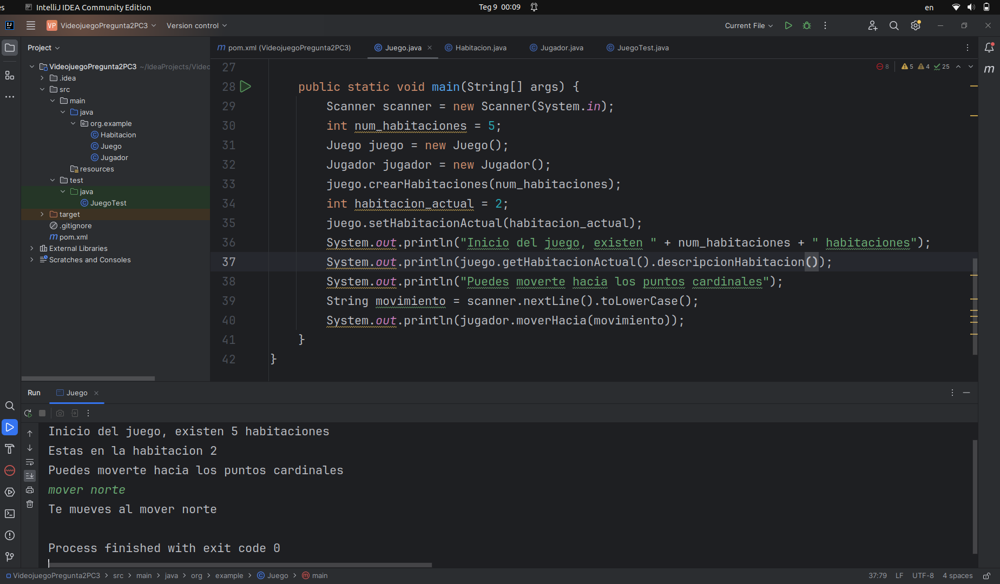 
Se observa que la salida es la esperada para este sprint 1, se muestra la habitacion inicial al iniciar el juego y el jugador puede moverse usando comandos (mover norte por ejemplo)

## SPRINT 2: Recolección de objetos y resolución de acertijos
### Clases a implementar:
* Objeto: Representa un objeto que puede ser recogido por el jugador.  
* Acertijo: Representa un acertijo que necesita ser resuelto en el juego.  
### Tareas:
1. Gestión de Objetos: Permitir a los jugadores recoger y usar objetos.  
2. Integración de acertijos: Implementar acertijos que los jugadores necesiten resolver para progresar.  
3. Mejoras en la interacción: Extender los comandos del jugador para incluir interacciones con objetos y acertijos.  
### Enfoque TDD:
Escribir pruebas para la recogida de objetos, gestión de inventario y mecánicas de resolución de acertijos.  
### Salida:
Recolección y uso funcional de objetos.  
Acertijos resolubles integrados en el flujo del juego.  

Para este 2do sprint, escribi 5 tests (recogerObjetoLlaveTest(), recogerObjetoPocionTest(), agregarObjetosAlInventarioTest(), acertijoResueltoTest(), acertijoNoResueltoTest())  
``` java
// SPRINT 2 TESTS
    // Test recoger objetos
    @Test
    public void recogerObjetoLlaveTest(){
        // Arrange
        Jugador jugador = new Jugador();
        Objeto objeto = new Objeto();
        objeto.setNombre("llave");
        // Act
        String resultado = jugador.recogerObjeto(objeto);
        // Assert
        assertEquals("Has recogido la llave", resultado, "Deberia mostrar que recogio la llave");
    }
    @Test
    public void recogerObjetoPocionTest(){
        // Arrange
        Jugador jugador = new Jugador();
        Objeto objeto = new Objeto();
        objeto.setNombre("pocion");
        // Act
        String resultado = jugador.recogerObjeto(objeto);
        // Assert
        assertEquals("Has recogido la pocion", resultado, "Deberia mostrar que recogio la pocion");
    }
    // Test gestion de inventario
    @Test
    public void agregarObjetosAlInventarioTest(){
        // Arrange
        Jugador jugador = new Jugador();
        Objeto objeto1 = new Objeto();
        Objeto objeto2 = new Objeto();
        objeto1.setNombre("llave");
        jugador.recogerObjeto(objeto1);
        objeto2.setNombre("pocion");
        jugador.recogerObjeto(objeto2);
        // Act
        boolean resultado1 = jugador.getObjeto(objeto1);
        boolean resultado2 = jugador.getObjeto(objeto2);
        // Assert
        assertEquals(true, resultado1, "Deberia devolver true");
        assertEquals(true, resultado2, "Deberia devolver true");
    }
    // Test mecanica de resolucion de acertijos
    @Test
    public void acertijoResueltoTest(){
        // Arrange
        String pregunta = "¿Qué tiene un ojo pero no puede ver?";
        String respuesta = "ahuja";
        Acertijo acertijo = new Acertijo(pregunta, respuesta);
        String respuesta_jugador = "ahuja";
        // Act
        boolean resultado = acertijo.resolvioAcertijo(respuesta_jugador);
        // Assert
        assertEquals(true, resultado, "Deberia devolver true");
    }
    @Test
    public void acertijoNoResueltoTest(){
        // Arrange
        String pregunta = "¿Qué tiene un ojo pero no puede ver?";
        String respuesta = "ahuja";
        Acertijo acertijo = new Acertijo(pregunta, respuesta);
        String respuesta_jugador = "pulpo";
        // Act
        boolean resultado = acertijo.resolvioAcertijo(respuesta_jugador);
        // Assert
        assertEquals(false, resultado, "Deberia devolver false");
    }
```

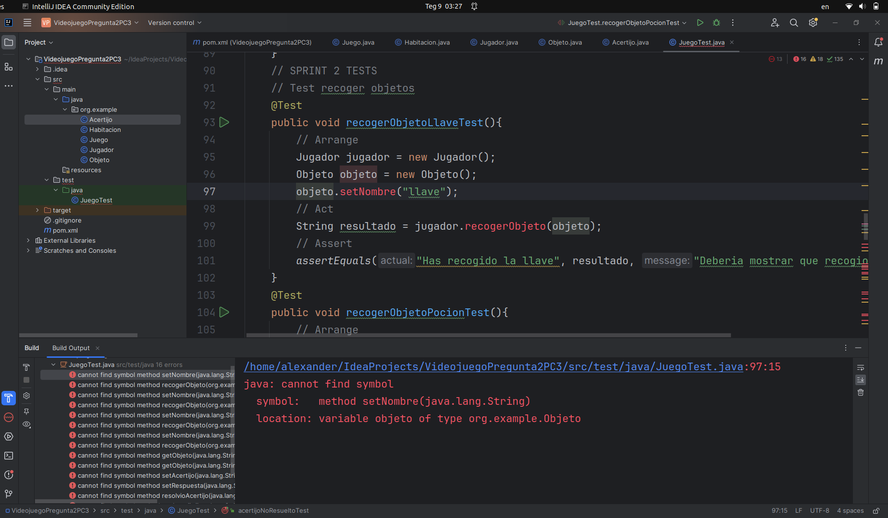  
En la imagen se observa que dichos tests no pasaron (estan color rojo) debido a que aun no se han implementado las clases Objeto y Acertijo. Ahora escribo codigo necesario para que pasen dichos tests.  
``` java
package org.example;

public class Objeto {
    String nombre;
    public String getNombre() {
        return nombre;
    }
    public void setNombre(String nombre){
        this.nombre = nombre;
    }
}
```
``` java
package org.example;

public class Acertijo {
    String pregunta;
    String respuesta;
    public Acertijo(String pregunta, String respuesta){
        this.pregunta = pregunta;
        this.respuesta = respuesta;
    }
    public boolean resolvioAcertijo(String respuestaJugador) {
        if(respuesta.equals(respuestaJugador)){
            return true;
        }
        return false;
    }
}
```
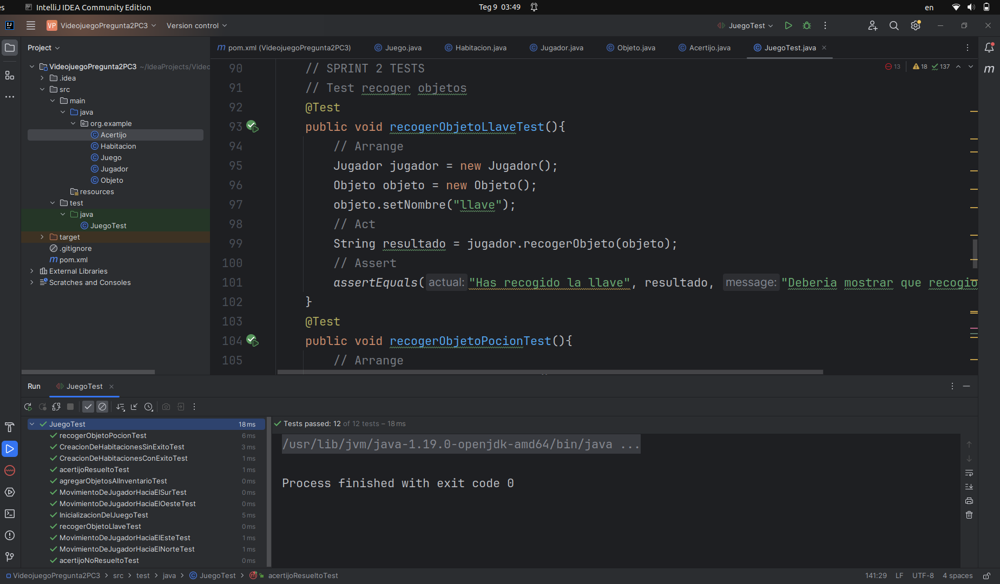   
Como se observa en la imagen, los 5 tests pasaron exitosamente (estan color verde).  
  
Ejecucion de la clase principal, Juego  
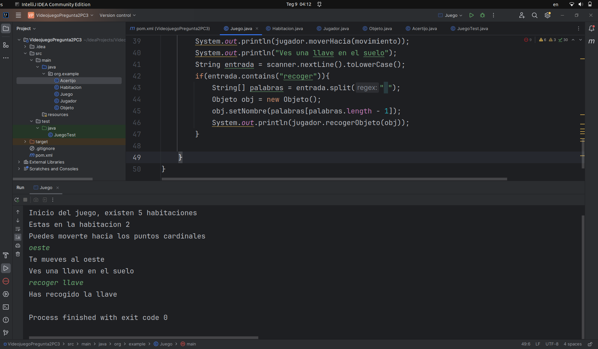 
Se observa que la salida es la esperada para este sprint 2, se muestra gestión de objetos y la integración de acertijos

## SPRINT 3: Refinamiento del juego y aplicación de métricas
### Tareas de refinamiento:
* Refactoriza el código para reducir el acoplamiento.  
* Analiza y aplica métricas de acoplamiento (Ce, Ca, CF) para mejorar el diseño.  
* Mejora las mecánicas del juego basándose en la retroalimentación de las pruebas.
### Tareas:
Refactorización para bajo acoplamiento:  
* Asegura que cada clase tenga dependencias mínimas con otras.  
* Calcula y documenta las métricas Ce, Ca y CF.  
### Toques finales:
* Añade acertijos y objetos finales.  
* Mejora la retroalimentación del usuario y la narrativa del juego.  
### Enfoque TDD:
Escribe pruebas adicionales para cubrir las nuevas características añadidas y el código refactorizado.  
### Salida:
Diseño del juego mejorado con métricas de acoplamiento más bajas.  
Juego finalizado con una narrativa completa y mecánicas funcionales.  

Para este 3er sprint, escribi 4 tests
``` java
// SPRINT 3
    // Test para el final del juego
    @Test
    public void elJuegoHaTerminadoCuandoEncuentraElObjetivoFinalTest(){
        // Arrange
        Juego juego = new Juego();
        juego.setObjetivoFinal("llave dorada");
        Objeto obj = new Objeto();
        obj.setNombre("llave dorada");
        Jugador jugador = new Jugador();
        jugador.recogerObjeto(obj);
        // Act
        boolean resultado = jugador.encontroObjetivoFinal(juego.getObjetivoFinal());
        // Assert
        assertEquals(true, resultado, "Deberia devolver true");
    }
    @Test
    public void elJuegoNoHaTerminadoCuandoNoEncuentraElObjetivoFinalTest(){
        // Arrange
        Juego juego = new Juego();
        juego.setObjetivoFinal("llave dorada");
        Objeto obj = new Objeto();
        obj.setNombre("pocion");
        Jugador jugador = new Jugador();
        jugador.recogerObjeto(obj);
        // Act
        boolean resultado = jugador.encontroObjetivoFinal(juego.getObjetivoFinal());
        // Assert
        assertEquals(false, resultado, "Deberia devolver false");
    }
    @Test
    public void elJuegoHaTerminadoCuandoCompletaLaMisionPrincipalTest(){
        // Arrange
        Juego juego = new Juego();
        juego.setMisionPrincipal("Resolver 3 acertijos");
        Jugador jugador = new Jugador();
        String pregunta = "¿Qué tiene un ojo pero no puede ver?";
        String respuesta = "ahuja";
        Acertijo acertijo = new Acertijo(pregunta, respuesta);
        String respuesta_jugador = "ahuja";
        jugador.resolverAcertijo(acertijo, respuesta_jugador);

        pregunta = "¿Qué se moja mientras seca?";
        respuesta = "toalla";
        acertijo = new Acertijo(pregunta, respuesta);
        respuesta_jugador = "toalla";
        jugador.resolverAcertijo(acertijo, respuesta_jugador);

        pregunta = "Soy alto cuando soy joven, y soy bajo cuando soy viejo. ¿Qué soy?";
        respuesta = "vela";
        acertijo = new Acertijo(pregunta, respuesta);
        respuesta_jugador = "vela";
        jugador.resolverAcertijo(acertijo, respuesta_jugador);
        // Act
        boolean resultado = jugador.completoMisionPrincipal();
        // Assert
        assertEquals(true, resultado, "Deberia devolver true");
    }
    @Test
    public void elJuegoNoHaTerminadoCuandoNoCompletaLaMisionPrincipalTest(){
        // Arrange
        Juego juego = new Juego();
        juego.setMisionPrincipal("Resolver 3 acertijos");
        Jugador jugador = new Jugador();
        String pregunta = "¿Qué tiene un ojo pero no puede ver?";
        String respuesta = "ahuja";
        Acertijo acertijo = new Acertijo(pregunta, respuesta);
        String respuesta_jugador = "pulpo";
        jugador.resolverAcertijo(acertijo, respuesta_jugador);

        pregunta = "¿Qué se moja mientras seca?";
        respuesta = "toalla";
        acertijo = new Acertijo(pregunta, respuesta);
        respuesta_jugador = "toalla";
        jugador.resolverAcertijo(acertijo, respuesta_jugador);

        pregunta = "Soy alto cuando soy joven, y soy bajo cuando soy viejo. ¿Qué soy?";
        respuesta = "vela";
        acertijo = new Acertijo(pregunta, respuesta);
        respuesta_jugador = "vela";
        jugador.resolverAcertijo(acertijo, respuesta_jugador);
        // Act
        boolean resultado = jugador.completoMisionPrincipal();
        // Assert
        assertEquals(false, resultado, "Deberia devolver false");
    }
```
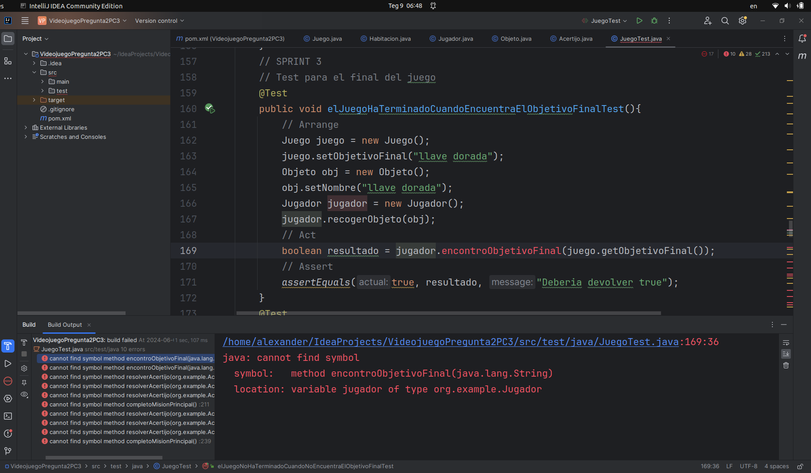  
En la imagen se observa que dichos tests no pasaron (estan color rojo) debido a que aun no se han implementado los nuevos metodos. Ahora escribo codigo necesario para que pasen dichos tests.  

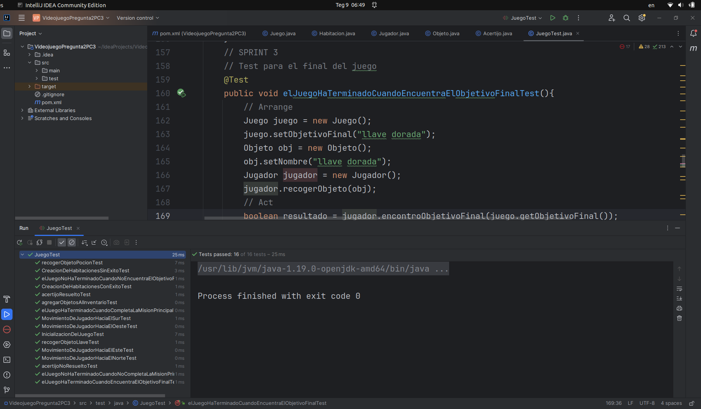   
Como se observa en la imagen, los 4 tests pasaron exitosamente (estan color verde).  

Ejecucion de la clase principal, Juego  
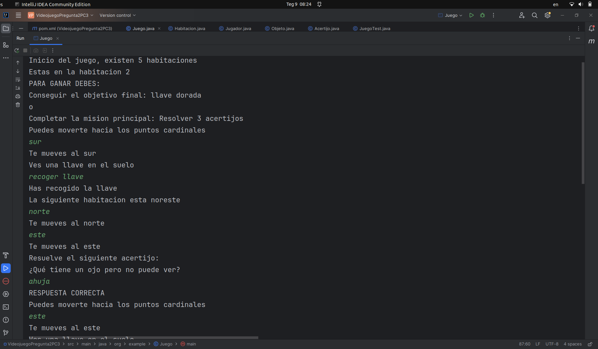  
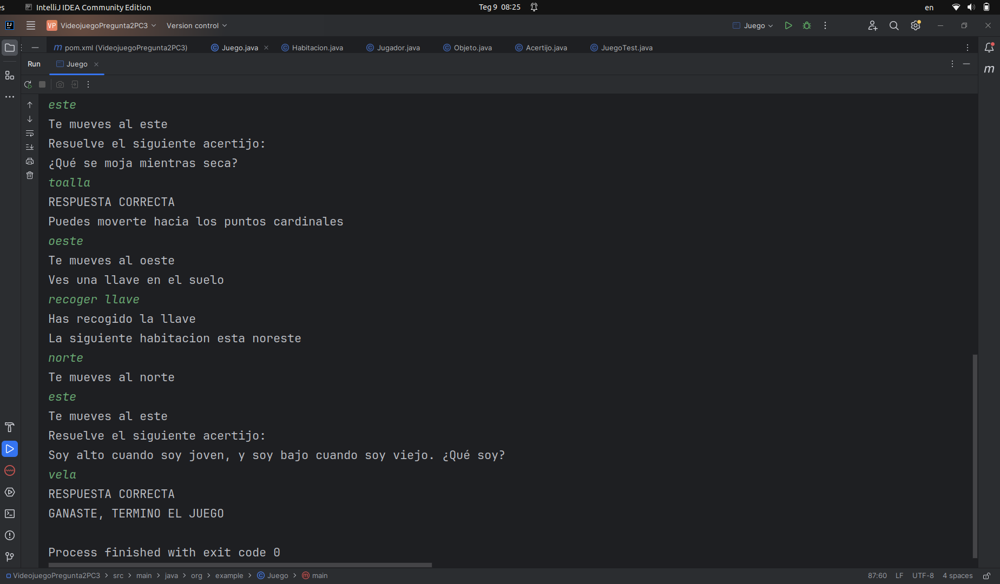  
Se observa el flujo del juego. Puse una variable llamada iteraciones para controlar las cantidad de veces que itera el bucle while, en caso llegue a la cantidad de iteraciones (4 en el codigo), entonces el jugador encuentra el objetivo final y gana el juego. Otra forma de ganar es que complete la mision principal (adivinar 3 acertijos)

Calculo del factor de acoplamiento:
``` java
package org.example;

public class CalculoFactorDeAcoplamiento {
    public static void main(String[] args) {
        /*
        Juego
        Habitacion
        Jugador
        Objeto
        Acertijo
        */
        Module juego = new Module("Juego");
        Module habitacion = new Module("Habitacion");
        Module jugador = new Module("Jugador");
        Module objeto = new Module("Objeto");
        Module acertijo = new Module("Acertijo");

        juego.addDependency(juego);
        juego.addDependency(habitacion);
        juego.addDependency(jugador);
        juego.addDependency(objeto);
        juego.addDependency(acertijo);

        jugador.addDependency(objeto);
        jugador.addDependency(acertijo);
        Module[] modules = {juego,habitacion,jugador,objeto,acertijo};

        int totalDependencies = 0;
        for (Module module : modules) {
            totalDependencies += module.getDependencies().size();
        }

        int totalModules = modules.length;

        double factor_acoplamiento = (double) totalDependencies / (totalModules * (totalModules - 1));
        System.out.println("Factor de acoplamiento: " + factor_acoplamiento);
    }
}
```
``` java
package org.example;

import java.util.HashSet;
import java.util.Set;

public class Module {
    private String name;
    private Set<Module> dependencies;

    public Module(String name) {
        this.name = name;
        this.dependencies = new HashSet<>();
    }

    public String getName() {
        return name;
    }

    public void addDependency(Module module) {
        dependencies.add(module);
    }

    public Set<Module> getDependencies() {
        return dependencies;
    }
}
```
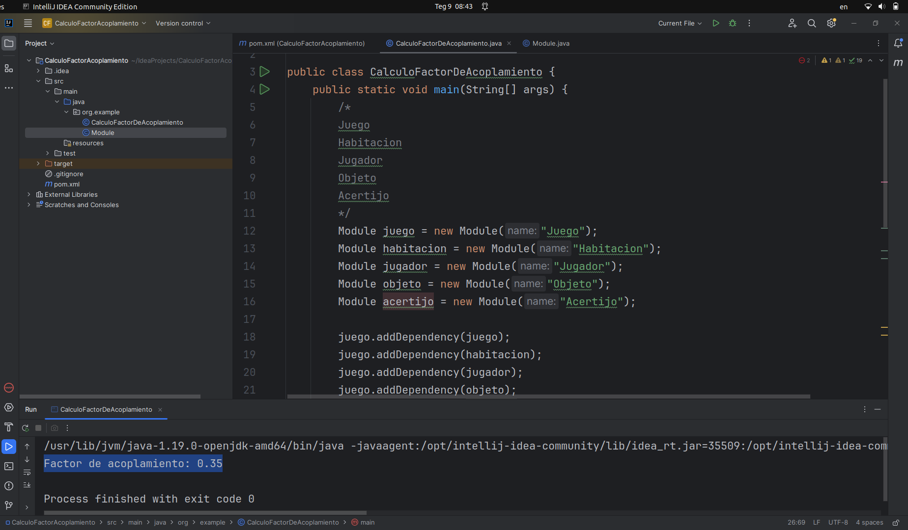  
Se observa que el factor de acoplamiento es 0.35, y dado que el factor de acoplamiento varia entre 0 y 1, entonces este valor (0.35) es bajo, por lo tanto tiene mayor modularidad y mantenibilidad.  

Calculo del Acoplamiento aferente (Ca) y eferente (Ce) para cada una de las clases (Juego, Habitacion, Jugador, Objeto, Acertijo)  
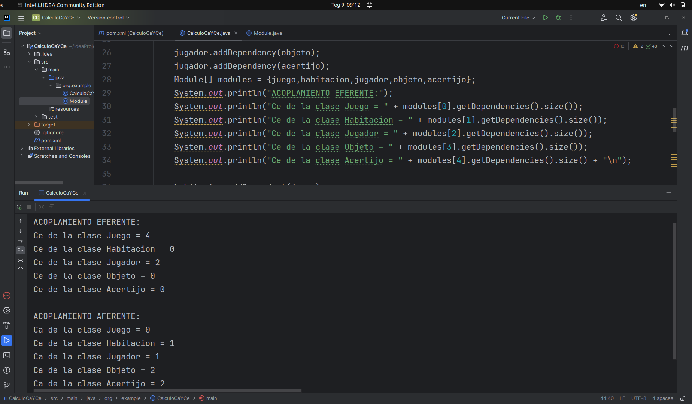  
Se observa la cantidad de clases externas que utilizan cierta clase (ca) y la cantidad de clases externas que son utilizadas por cierta clase (ce)

## Jacoco
Para usar Jacoco, se modifico el pom.xml
``` java
<?xml version="1.0" encoding="UTF-8"?>
<project xmlns="http://maven.apache.org/POM/4.0.0"
         xmlns:xsi="http://www.w3.org/2001/XMLSchema-instance"
         xsi:schemaLocation="http://maven.apache.org/POM/4.0.0 http://maven.apache.org/xsd/maven-4.0.0.xsd">
    <modelVersion>4.0.0</modelVersion>

    <groupId>org.example</groupId>
    <artifactId>VideojuegoPregunta2PC3</artifactId>
    <version>1.0-SNAPSHOT</version>

    <properties>
        <maven.compiler.source>19</maven.compiler.source>
        <maven.compiler.target>19</maven.compiler.target>
        <project.build.sourceEncoding>UTF-8</project.build.sourceEncoding>
    </properties>
    <dependencies>
        <dependency>
            <groupId>org.testng</groupId>
            <artifactId>testng</artifactId>
            <version>RELEASE</version>
            <scope>test</scope>
        </dependency>
        <dependency>
            <groupId>junit</groupId>
            <artifactId>junit</artifactId>
            <version>4.13.2</version>
            <scope>test</scope>
        </dependency>
    </dependencies>
    <build>
        <plugins>
            <plugin>
                <groupId>org.jacoco</groupId>
                <artifactId>jacoco-maven-plugin</artifactId>
                <version>0.8.10</version>
                <executions>
                    <execution>
                        <goals>
                            <goal>prepare-agent</goal>
                        </goals>
                    </execution>
                    <!-- attached to Maven test phase -->
                    <execution>
                        <id>report</id>
                        <phase>test</phase>
                        <goals>
                            <goal>report</goal>
                        </goals>
                    </execution>
                </executions>
            </plugin>
        </plugins>
    </build>

</project>
```
Luego al ejecutar, tuve como resultado  
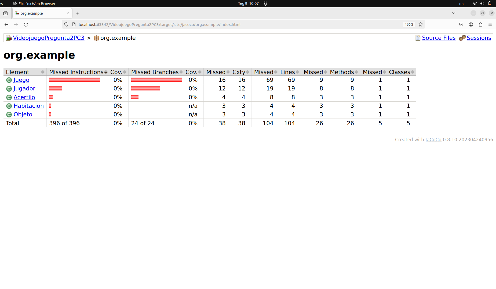  
Dado que el porcentaje salio 0, debo de refactorizar el codigo
